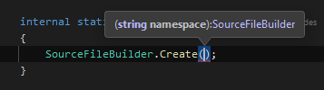
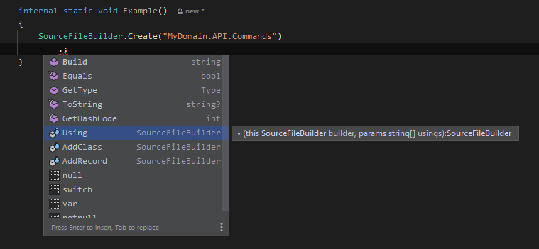
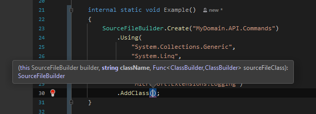
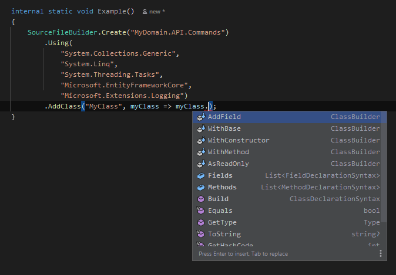

# [FluentRoslyn.CSharp](https://www.nuget.org/packages/StarBridge.FluentRoslyn.CSharp)

[](https://www.nuget.org/packages/StarBridge.FluentRoslyn.CSharp)

A fluent builder-pattern syntax for orchestration of domain-specific code generators.

🔎 Find it on [`nuget.org`](https://www.nuget.org/packages/StarBridge.FluentRoslyn.CSharp)

# Cold Open (Example)

```csharp
var sourceFileContents = SourceFileBuilder
    .Create($"MyDomain.Infrastructure.Queries.MyEntities")
    .Using(
        "System.Threading",
        "System.Threading.Tasks",
        "MediatR",
        "MyDomain.API.SDK.Clients.QueryResponses")
    .AddClass(handlerName, @class => @class
        .WithBase($"IRequestHandler<GetMyEntity, GetMyEntityResponse>")
        .AddField(
            "IMyEntityQueryRepository",
            field => field
                .WithAccessibility(Access.Private)
                .AsReadOnly())
        .WithConstructor(ConstructorBuilder
            .Create(handlerName)
            .WithParameters(parameters => parameters
                .AddParameter("IMyEntityQueryRepository", "myEntityQueryRepository")
            )
            .WithBody(body => body
                .AddStatement("_myEntityQueryRepository = myEntityQueryRepository;")
            )
        )
        .WithMethod(
            "Handle",
            method => method
                .WithAccessibility(Access.Public)
                .WithParameters(parameters => parameters
                    .AddParameter("GetMyEntity", "query")
                    .AddParameter("CancellationToken"))
                .WithBody(body => body
                    .AddStatement("var entity = await _myEntityQueryRepository.GetAsync(query.Id);")
                    .AddStatement("return new(entity.Identity, entity.Name, entity.Description);")
                )
                .Returns("GetMyEntityResponse")
                .AsAsync()
        )
    )
    .Build();
```


# Getting Started

> ⚠️ **WARNING**
>
> Examples last updated at version `0.1.0-alpha`


## Create Console Application

Create a console project in your solution, i.e. `<target-project>.CodeGenerator`


```bash
#!/usr/bin/env bash

# change these
repoDir="${HOME}/src/MyRepo"
targetProject="MyDomain"

# create project in solution
cd "$repoDir/project"
generatorProject = "${targetProject}.CodeGenerator"
dotnet new console --name "$generatorProject"
dotnet sln add "$generatorProject"
```

## Create a generator 'set'

example for generating query:

```csharp
using StarBridge.FluentRoslyn.CSharp.Model;

namespace MyDomain.CodeGenerator;

internal class ApiGenerator
{
    private readonly IFileRepository _fileRepository;

    public ApiGenerator(IFileRepository fileRepository)
    {
        _fileRepository = fileRepository;
    }

    internal void GenerateQuery(ProjectInfo project, Entity entity)
    {
        // response
        var response = entity.GenerateQueryResponse(project);
        _fileRepository.Save(response);

        // query
        var query = entity.GenerateQuery(project);
        _fileRepository.Save(query);

        // query handler
        var handler = entity.GenerateQueryHandler(project);
        _fileRepository.Save(handler);
    }
}
```

## Invoke

Call it from your entry point

```csharp
using StarBridge.FluentRoslyn.CSharp.Model;
using MyDomain.CodeGenerator;

var fileRepository = new FileRepository(); // out of scope for example
var apiGenerator = new ApiGenerator(fileRepository);

var projectName = new ProjectName("MyDomain");
var projectDir = "/home/username/src/MyDomain/project/MyDomain.API";
var project = new ProjectInfo(projectName, projectDir);

var entity = new Entity(
    new EntityName(
        Singular: "MyEntity",
        Plural: "TheEntities"));

apiGenerator.GenerateQuery(project, entity);
```

## Write Generators

Example - Write each file as an extension of `Entity`:

```csharp
using FluentRoslyn.CSharp;
using FluentRoslyn.CSharp.Model;
using Microsoft.CodeAnalysis.CSharp;

namespace MyDomain.CodeGenerator;

public static class ApiQueryFactory
{
    /// <summary>
    ///     Generates <b>MyDomain.API.SDK/Clients/QueryTheEntities/GetMyEntityResponse.cs</b>
    /// </summary>
    internal static GeneratedFile GenerateQueryResponse(this Entity entity, ProjectInfo project)
    {
        var responsePath = $"{project.SdkName}\\Clients\\QueryResponses\\Get{entity.Name.Singular}Response.cs";
        var responseFileInfo = project.GetInfo(responsePath);
        var recordName = $"Get{entity.Name.Singular}Response";
        var fileName = $"{recordName}.cs";
        var responseFileContents = SourceFileBuilder
            .Create("MyDomain.API.SDK.Clients.QueryResponses")
            .Using("MyDomain.Core.Identity")
            .AddRecord(recordName, rec => rec
                .WithParameters(param => param
                    .AddParameter(entity.Name.Identifier, "Identity")
                    .AddParameter(SyntaxKind.StringKeyword, "Name")
                    .AddParameter(SyntaxKind.StringKeyword, "Description")))
            .Build();
        var responseFile = new GeneratedFile(responseFileInfo, responseFileContents);
        return responseFile;
    }

    /// <summary>
    ///     Generates <b>MyDomain.Infrastructure.Queries/TheEntities/GetMyEntity.cs</b>
    /// </summary>
    internal static GeneratedFile GenerateQuery(this Entity entity, ProjectInfo project) { /**/ }

    /// <summary>
    ///     Generates <b>MyDomain.Infrastructure.Queries/MyEntities/GetMyEntityHandler.cs</b>
    /// </summary>
    internal static GeneratedFile GenerateQueryHandler(this Entity entity, ProjectInfo project) { /**/ }
}
```

## Fluent Syntax - Intellisense

_The fluent syntax should promote discovery_ 🤔 Feel free to create an issue if something isn't intuitive!

<details>
  <summary>IDE Example Screenshots... Click to expand!</summary>
    <br />
    <br />
    <br />
    <br />
</details>


## Backlog

- 📜 Contributing Guidelines
- 🧪 Tests which will provide examples, and document builder permutations
- 🔨 More coverage of Roslyn ([Dogfooding](https://www.techopedia.com/definition/30784/dogfooding) this package for a personal project)
- 🪠 Build Pipeline
- 💻 Command-line Interface